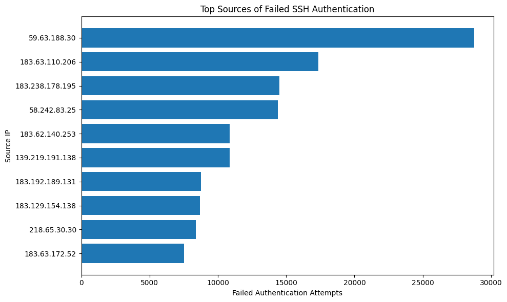
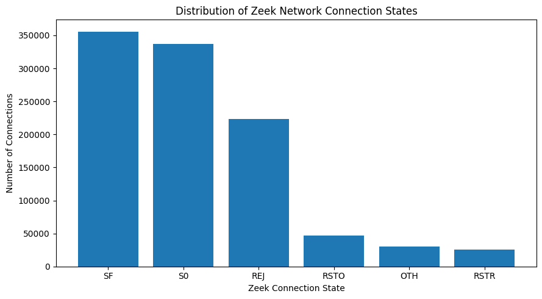

# Big Data Security Log Analytics with Hadoop and PySpark

A cybersecurity data analytics project demonstrating how **Hadoop, HDFS, MapReduce, PySpark, and Spark SQL** can be used to process large-scale authentication and network telemetry and identify activity that may warrant security investigation.

The project analyzes real **OpenSSH authentication logs** and **Zeek network connection logs**, combining distributed log processing with security-focused analytics.

## Project Objectives

- Store and process cybersecurity logs using **Hadoop Distributed File System (HDFS)**.
- Use **Hadoop Streaming and Python MapReduce** to aggregate failed SSH authentication attempts.
- Analyze more than **1 million Zeek network connection records** using **PySpark**.
- Use **Spark SQL** to investigate network behavior and suspicious connection patterns.
- Perform data cleaning, transformation, and ETL on raw security telemetry.
- Store transformed network data in **Parquet** format for efficient analytical workloads.
- Translate large-scale log-processing results into actionable security findings.

## Architecture

```text
OpenSSH Authentication Logs
          │
          ▼
         HDFS
          │
          ▼
 Hadoop Streaming / MapReduce
          │
    Mapper → Shuffle/Sort → Reducer
          │
          ▼
 Failed Authentication Analysis


Zeek conn.log
      │
      ▼
    PySpark
      │
      ▼
Cleaning & Transformation
      │
      ▼
   Spark SQL
      │
      ▼
Network Behavior Analysis
      │
      ▼
    Parquet
```

## Technologies Used

- **Hadoop 3.4.1**
- **HDFS**
- **Hadoop Streaming**
- **MapReduce**
- **Python**
- **PySpark**
- **Spark SQL**
- **Apache Parquet**
- **Zeek**
- **OpenSSH logs**
- **Google Colab**
- **Matplotlib**

## Datasets

### OpenSSH Authentication Logs

A real OpenSSH authentication dataset containing approximately **639,000 log records** was processed using Hadoop.

The analysis extracted failed-password events and aggregated them by source IP address using a Python mapper and reducer executed through Hadoop Streaming.

### Zeek Network Connection Logs

A real Zeek `conn.log` dataset containing **1,021,950 network connection records** was processed using PySpark.

The telemetry includes:

- Source and destination IP addresses
- Source and destination ports
- Network protocols and services
- Connection states
- Connection duration
- Traffic volume

## Hadoop Authentication Analysis

The OpenSSH logs were stored in HDFS and processed using Hadoop Streaming.

The **mapper** filtered failed-password events and emitted:

```text
source_ip    1
```

Hadoop then performed **shuffle and sort** to group records belonging to the same source IP.

The **reducer** aggregated the values to calculate the total number of failed authentication attempts associated with each source.

### Authentication Findings

- **197,587** failed SSH authentication events were identified.
- Failed attempts originated from **1,008 unique source IP addresses**.
- `59.63.188.30` generated **28,766 failed attempts**, approximately **14.56%** of all failed-password events.
- The top 5 sources accounted for approximately **43.45%** of failed authentication activity.
- The top 20 sources accounted for approximately **83.64%**.

Repeated authentication failures from concentrated sources may warrant investigation for password guessing or brute-force activity.



## PySpark Network Analysis

PySpark was used to parse and transform the Zeek connection telemetry into a structured DataFrame.

The analysis examined:

- High-volume source systems
- Frequently contacted destination ports
- Connection states
- Unsuccessful network connections
- Destination-IP diversity
- Destination-port diversity
- Potential scanning or reconnaissance patterns

### Connection State Analysis

The most common Zeek connection states included:

- `SF` — successfully established and terminated connection
- `S0` — connection attempt observed without a response
- `REJ` — connection attempt explicitly rejected
- `RSTO` — connection reset by the originator

`S0` and `REJ` represented a substantial portion of the observed network activity.



## Network Security Findings

Several internal systems demonstrated network behavior warranting further investigation.

**`10.174.251.215`**
- Generated **279,014 total connections**
- Generated **262,476 unsuccessful connections**

**`10.128.0.241`**
- Generated **33,361 connections**
- Contacted **257 destination IP addresses**
- Contacted **1,117 unique destination ports**

The unusually broad port coverage may be consistent with scanning or reconnaissance behavior.

**`10.128.0.207`**
- Generated **40,923 connections**
- Contacted **8,447 unique destination IP addresses**
- Contacted **141 unique destination ports**

This represents unusually broad network reach and may warrant additional investigation.

These findings are **investigative indicators rather than confirmation of malicious activity**. Additional context such as asset roles, timestamps, baselines, threat intelligence, and endpoint telemetry would be required for final attribution.

## Spark SQL

The structured Zeek telemetry was registered as a Spark SQL temporary view, allowing SQL queries to be used for security investigation.

Spark SQL was used to identify:

- Sources contacting large numbers of destination ports
- Sources communicating with large numbers of destination systems
- Sources generating high volumes of unsuccessful connections

This demonstrates how familiar SQL-based analysis can be applied to distributed security datasets.

## ETL and Parquet

The raw Zeek telemetry was:

1. Loaded into Spark.
2. Filtered to remove Zeek metadata records.
3. Parsed into structured columns.
4. Cleaned by converting Zeek `-` placeholders to null values.
5. Cast into appropriate numeric and string data types.
6. Analyzed using PySpark and Spark SQL.
7. Written to **Parquet** format.

The final Parquet dataset contained **1,021,950 structured network records**.

## Repository Structure

```text
cybersecurity-log-analytics/
│
├── notebooks/
│   └── Big_Data_Security_Log_Analytics.ipynb
│
├── images/
│   ├── top_failed_ssh_sources.png
│   └── zeek_connection_states.png
│
└── README.md
```

## Skills Demonstrated

- Big data security analytics
- Hadoop and HDFS
- MapReduce
- Hadoop Streaming
- Python log processing
- PySpark
- Spark SQL
- Security log analysis
- Authentication threat analysis
- Network security analytics
- Data cleaning and transformation
- ETL
- Parquet
- Threat hunting and investigative analysis
- Security findings documentation

## Limitations

- Hadoop was configured in a **pseudo-distributed single-node environment** for demonstration and learning rather than a production multi-node cluster.
- The datasets are public security datasets and do not represent live enterprise telemetry.
- High-volume failed authentication or network activity does not independently confirm malicious behavior.
- Additional contextual telemetry and threat intelligence would be required for complete incident investigation.

## Project Summary

This project demonstrates an end-to-end security analytics workflow using big-data technologies.

**OpenSSH Logs → HDFS → Hadoop MapReduce → Authentication Analysis**

**Zeek Network Logs → PySpark → Spark SQL → Network Analysis → Parquet**

The project demonstrates how distributed data-processing technologies can support **security monitoring, threat detection, investigative analytics, and large-scale log analysis**.
